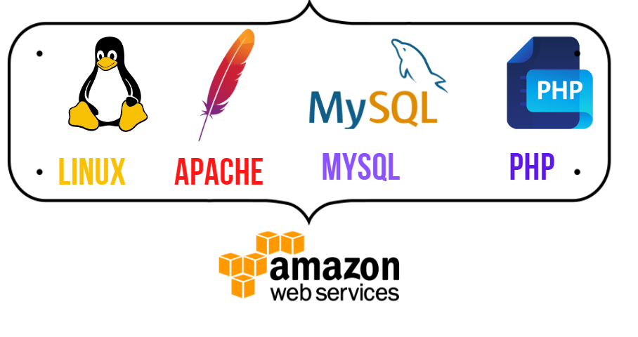

# Harnessing the Power of AWS: Building a LAMP Stack Web Server for Your Website

## Introduction

A technology stack is a thoughtfully assembled software tools, programming languages, frameworks, and libraries which are meticulously selected to collaboratively contribute to the development and maintenance of a well-functioning software. These stacks are often represented by acronyms, encapsulating the specific technologies harmoniously utilized in the creation of a tailored technology product. Some examples are.


- LAMP (Linux, Apache, MySQL, PHP or Python, or Perl)
- LEMP (Linux, Nginx, MySQL, PHP or Python, or Perl)
- MERN (MongoDB, ExpressJS, ReactJS, NodeJS)
- MEAN (MongoDB, ExpressJS, AngularJS, NodeJS)

In this blog, we'll guide you through the process of setting up a LAMP stack web server on the Amazon Web Services (AWS) platform, empowering you to deploy and host your web applications seamlessly.

## Step 1: Launch an AWS EC2 Instance

To complete this project its expected that you already have an Amazon Account and know how to create an EC2 instance if you dont here is a link where you can learn this.
https://dev.to/cloudforce/getting-started-with-ec2-a-beginners-guide-to-launching-your-first-cloud-instance-23cg

## Step 2: Configure Security Groups

When creating your EC2 instance, ensure to configure security groups to allow traffic on necessary ports. Open ports 22 (SSH), 80 (HTTP), and 443 (HTTPS) to enable remote access and web traffic.

## Step 3: Connect to Your EC2 Instance

Once your instance is running, connect to it using SSH. You can use You can use a tool like PuTTY on Windows or the terminal on Linux/Mac.i would be using Git Bash. Also ensure that you have the private key corresponding to the key pair selected during instance creation.you will change directory (cd) to the directory where you saved the key, this will enable you SSH into the instance successfully. 

- Connect to the instance by running

```
ssh -i <private-key-name>.pem ubuntu@<Public-IP-address>
``` 
  

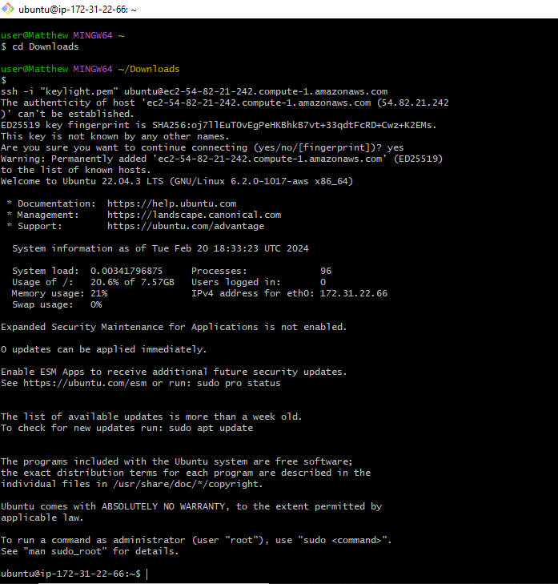

## Step 4: Update Packages and Firewall

Update the package list installed on your instance using the below command:

```
sudo apt update
```
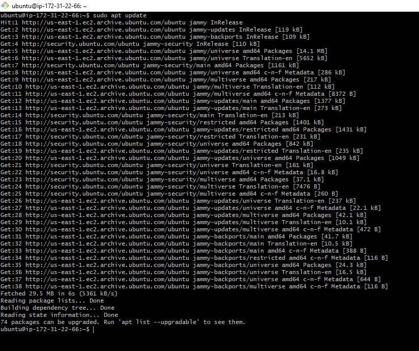


## Step 5: Step 5: Install Apache2 Web Server

What exactly is Apache?

Apache is an open-source web server software widely used for hosting websites and applications, it is free. It runs in no less than 65% of the worlds servers. Its modular architecture, cross-platform compatibility, and community support make it a popular choice for serving web content. Apache's features include virtual hosting, security measures, and flexibility through customizable modules.

Install Apache using Ubuntu’s package manager ‘apt’:

```
#run apache2 package installation
sudo apt install apache2
```
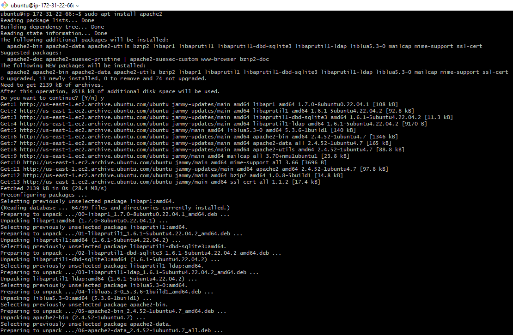

**To verify that apache2 is running as a Service in our OS, use following command**

```
sudo systemctl status apache2
```
- If its green and running then we did everything correctly.

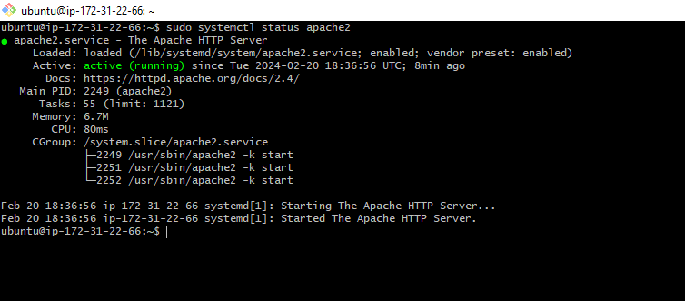

- We can also check our apache2 server locally in our ubuntu shell using the below command.


```
curl http://localhost:80
or
 curl http://127.0.0.1:80
```
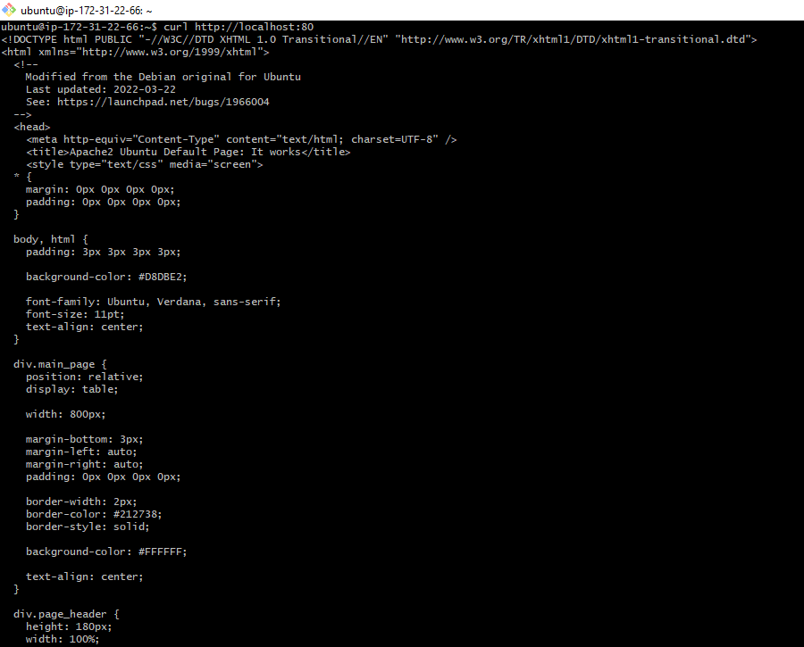

- We can also test how our Apache HTTP server can respond to requests from the Internet.
Open a web browser of your choice and try to access following url


```
http://<Public-IP-Address>:80
```

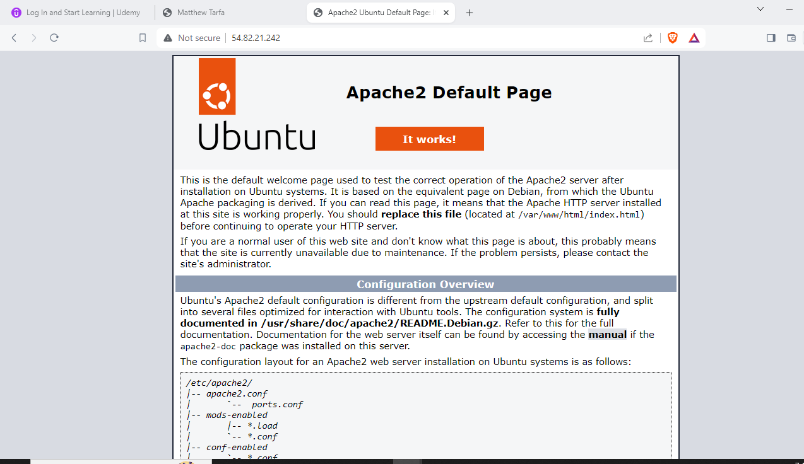


## Step 6: Install MySQL Database Server


MySQL is a widely used relational database management system (RDBMS) commonly employed in PHP environments. It facilitates the storage, retrieval, and management of structured data, playing a pivotal role in web application development. Known for its speed, reliability, and ease of integration with PHP, MySQL is a preferred choice for many developers building dynamic and data-driven websites.

Again, use ‘apt’ to acquire and install this software:

```
$ sudo apt install mysql-server
```
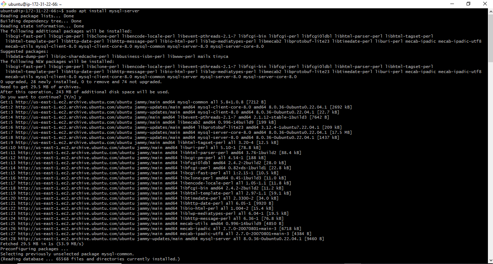

Confirm installation with 'Y' when prompted and press ENTER. After installation, log in to the MySQL console by typing:


```
$ sudo mysql
```
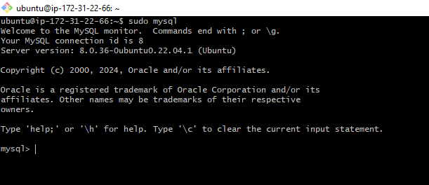

Exit the MySQL shell with:

```
mysql> exit
```
After installing MySQL, enhance security using the built-in script:
```
 $ sudo mysql_secure_installation
 ```
 Configure the VALIDATE PASSWORD PLUGIN, choose a policy level, and set a corresponding new password. Confirm changes by selecting 'Y' and pressing Enter to remove anonymous users, disable remote root logins, and apply new rules for immediate effect.

 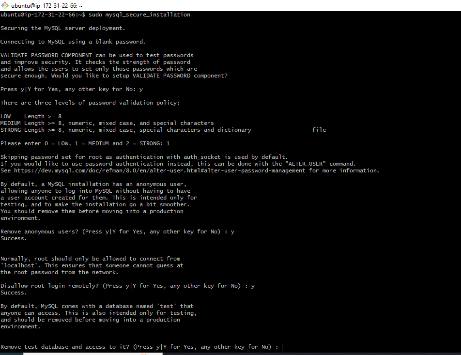

 If the password phase skipped then you would have to use the ALTER USER to set the password for the root user.

 run this command

 ```
$ sudo mysql -p
```

Notice the -p flag in this command, which will prompt you for the password used after changing the root user password.
and since you were unable to set a pass word initially press enter.

Now run this command in mysql shell

```
ALTER USER 'root'@'localhost' IDENTIFIED WITH mysql_native_password BY 'PassWord1';
```
change password1 to your desired password ensuring the password meets the required password standard you have selected earlier.

Exit the MySQL shell with:

```
mysql> exit
```
Now, you have successfully set a password for the root user using the MySQL shell.

run this command input your new pass word and you are in.

```
mysql -u root -p
```
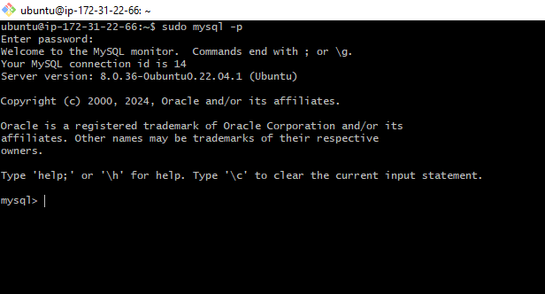

## Step 7: Install PHP and Required Modules

Apache serves content, MySQL manages data, and PHP processes code for dynamic content display in our setup.

Besides the php package,we will install php-mysql for PHP and MySQL communication and libapache2-mod-php to enable Apache to handle PHP files. Core PHP packages will be automatically installed as dependencies.

To install these 3 packages at once, run:

```
sudo apt install php libapache2-mod-php php-mysql
```
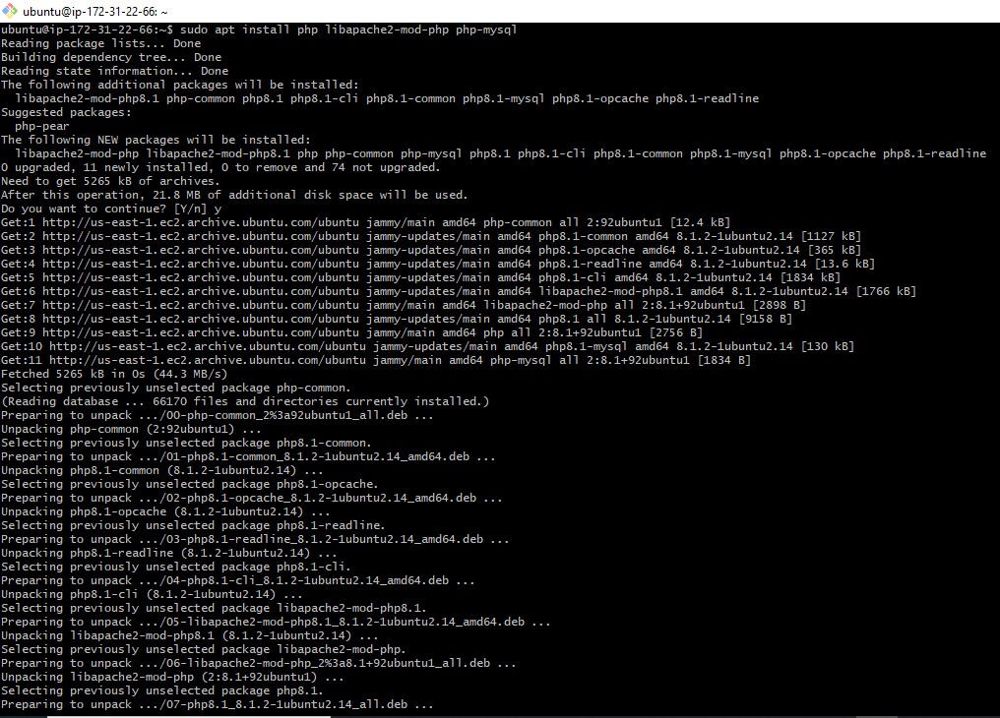

Once the installation is finished, you can run the following command to confirm your PHP version:

```
php -v
```
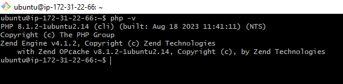

At this point the LAMP stack is now fully installed and operational with Ubuntu Linux, Apache HTTP Server, MySQL, and PHP components successfully integrated.

**We would take this a notch higher.**

## Step 8: Creating a Virtual Host for my Website using Apache

On Ubuntu 20.04, Apache comes with one default server block serving content from /var/www/html. To set up a virtual host, follow these steps:

- Create a directory named "lampstackproject" for your domain with the command:
```
 $ sudo mkdir /var/www/lampstackproject
 ```
- Assign ownership of the directory using the $USER environment variable to reference the current system user:
```
 $ sudo chown -R $USER:$USER /var/www/lampstackproject
 ```

- Create and open a new configuration file in Apache's sites-available directory using:
```
 $ sudo nano /etc/apache2/sites-available/lampstackproject.conf
```
- Paste the desired configurations into the opened file.

```
<VirtualHost *:80>
	    ServerName projectlamp
	    ServerAlias www.projectlamp 
	    ServerAdmin webmaster@localhost
	    DocumentRoot /var/www/projectlamp
	    ErrorLog ${APACHE_LOG_DIR}/error.log
	    CustomLog ${APACHE_LOG_DIR}/access.log combined
</VirtualHost>
```

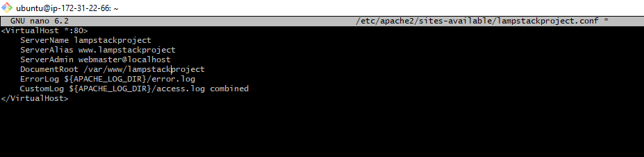

- Save and exit by pressing the "Ctrl + O " key, press "enter", and then pressing the "Ctrl + X " then press "Enter" key.

Enable the new virtual host with the command: $ sudo a2ensite projectlamp

Disable the default website installed with Apache using: $ sudo a2dissite 000-default

Ensure there are no errors in the configuration by running: $ sudo apache2ctl configtest

Reload Apache to apply the changes with the command: $ sudo systemctl reload apache2

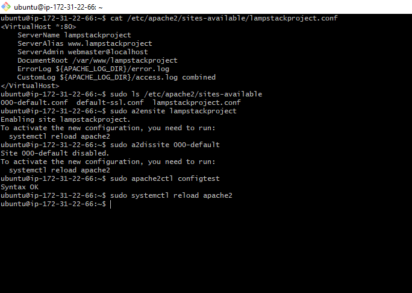
Create an index.html file in your domain directory to test the virtual host with:

```
 $ sudo bash -c "echo -e 'Hello LAMP from hostname\n<h2>MATTHEW Cloud Force</h2>\n<h3>It is not the strongest of the species that survive, nor the most intelligent, but the one most responsive to change.</h3>' > /var/www/lampstackproject/index.html"
 ```
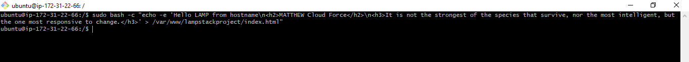

To test if your virtual host is working as expected, you can open your web browser and enter your server's IP address. In this case, it would be the public IP address of your AWS instance.

 If everything is set up correctly, you should see the content you added to the index.htm file, including the formatted text and headings.


## STEP 9: Enabling PHP on the website

The default DirectoryIndex settings on Apache prioritize index.html over index.php. This feature is beneficial for creating temporary maintenance pages in PHP applications. 

By crafting a brief message in a temporary index.html file, it takes precedence over index.php, serving as the landing page during maintenance. 

After completing the maintenance, the index.html can be renamed or removed from the document root, restoring the regular application page.

If you wish to modify this behavior, you must edit the /etc/apache2/mods-enabled/dir.conf file and adjust the order of the index.php file within the DirectoryIndex directive.

```
sudo nano /etc/apache2/mods-enabled/dir.conf
```

```
<IfModule mod_dir.c>
        #Change this:
        #DirectoryIndex index.html index.cgi index.pl index.php index.xhtml index.htm
        #To this:
        DirectoryIndex index.php index.html index.cgi index.pl index.xhtml index.htm
</IfModule>
```
- Upon saving and closing the file, it is necessary to reload Apache for the modifications to become effective:

```
sudo systemctl reload apache2
```

- create an index.php file and add a PHP script to test the installation and configuration of PHP on your server

```
nano /var/www/projectlamp/index.php
```
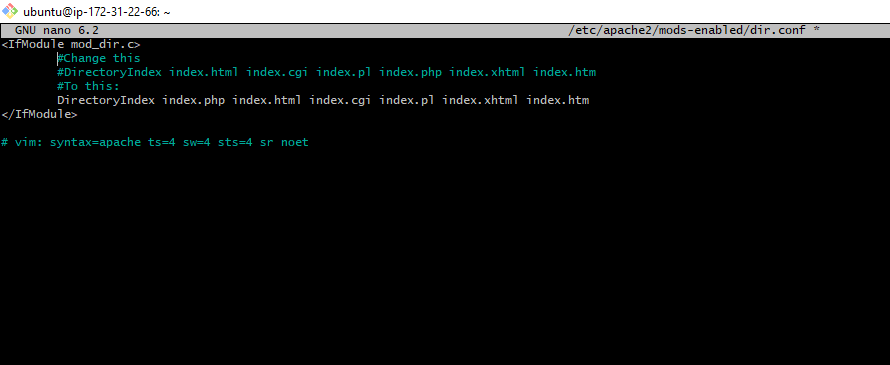

- This will open a blank file. Add the following text, which is valid PHP code, inside the file:

```
<?php
phpinfo();
```
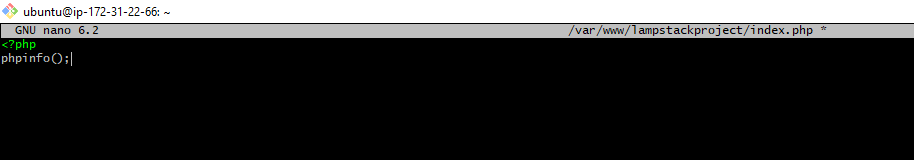

Once you've made the changes, save and close the file. Afterward, refresh the page in your web browser, and you should observe a page resembling this:

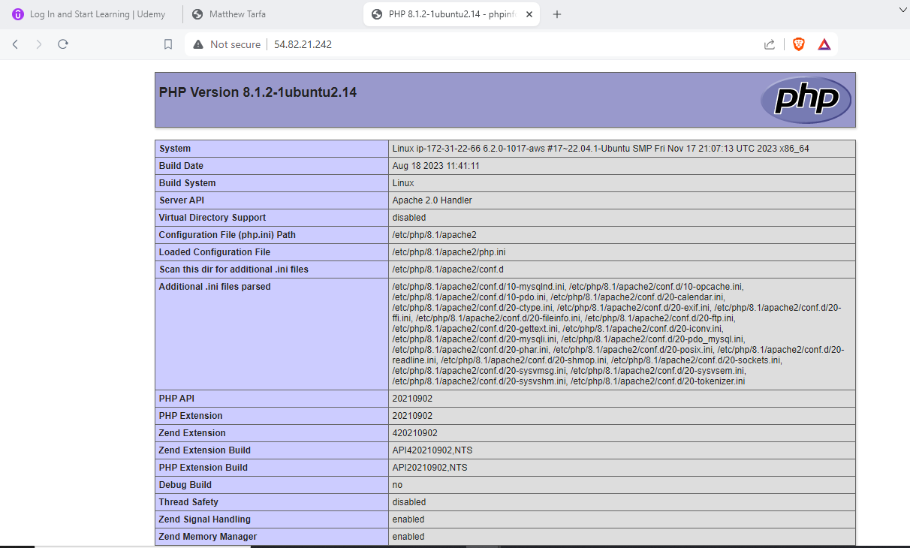

Remove the PHP file as it contains sensitive information, use the following command:

```
sudo rm /var/www/lampstackproject/index.php
```
This command deletes the index.php file from the specified directory.


Congratulations! You've successfully completed a real-life project by deploying a LAMP stack website in the AWS Cloud! This achievement not only demonstrates your technical prowess but also sets the stage for hosting and deploying dynamic web applications. As you continue, consider expanding your server's capabilities, fortifying its security, and confidently deploying future web projects. 

**May the Cloud Force Be with you!**